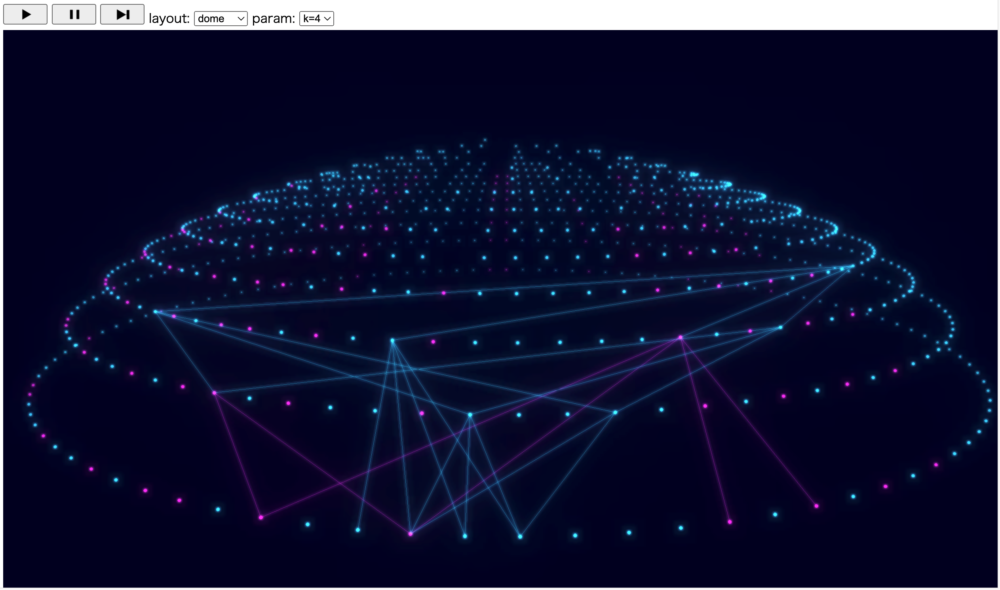

# visskip
A visualizer of ByzSkip simulations.

## Build

```sh
$ cd wasm
$ GOOS=js GOARCH=wasm go build -o bssim.wasm
$ cd ../webserver
$ go build
$ cd ..
```

Above commands generates ``wasm/bssim.wasm`` and `webserver/webserver`.

## Usage

Following commands install bssim.wasm binary to public folder and run a webserver.

```sh
$ cp wasm/bssim.wasm ./public
$ ./webserver/webserver
```

The webserver command runs a http server on port 3000 (hard-coded).

Now you can see the animated 100-node simulation on http://localhost:3000 using a modern browser.

## Screenshots

